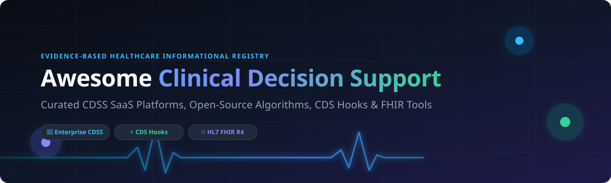

# 🩺 Awesome Clinical Decision Support System (CDSS)

    

**A comprehensive, SEO-optimized directory of top Clinical Decision Support Systems (CDSS), commercial SaaS platforms, evidence-based medicine engines, CDS Hooks integrations, and open-source medical AI software.**

*Last Updated: September 2026*

---

## 🔍 Overview & SEO Highlights

**Clinical Decision Support Systems (CDSS)** are health information technology software platforms designed to provide clinicians, nurses, pharmacists, and medical staff with person-specific, evidence-based clinical guidance at the point of care.

This curated list aggregates commercial SaaS platforms, computable practice guideline (CPG) engines, Fast Healthcare Interoperability Resources (**HL7 FHIR R4**) tools, **CDS Hooks** services, and diagnostic AI frameworks. Key capabilities covered include:
- 💊 **Drug-Drug Interaction (DDI) & Dosing Safety Alerts**
- 🩺 **Differential Diagnostic Assistance & Visual Symptom Checkers**
- 📋 **Computable Clinical Practice Guidelines (CPG) & Algorithm Execution**
- 🏥 **EHR-Integrated CDS Hooks & SMART on FHIR Workflow Automation**
- 🧬 **Standardized Medical Terminology Servers (SNOMED CT, LOINC, RxNorm)**

---

## 📑 Table of Contents

- [🔍 Overview \& SEO Highlights](#-overview--seo-highlights)
- [🏢 SaaS \& Hosted CDSS Platforms](#-saas--hosted-cdss-platforms)
- [⚡ Open-Source GitHub Projects](#-open-source-github-projects)
  - [1. Open-Source Healthcare Platforms \& EHR CDS Engines](#1-open-source-healthcare-platforms--ehr-cds-engines)
  - [2. Guideline Digitization \& Algorithm Execution](#2-guideline-digitization--algorithm-execution)
  - [3. Diagnostic Assistance, Medical AI \& Clinical Analytics](#3-diagnostic-assistance-medical-ai--clinical-analytics)
  - [4. Terminology Servers \& Standardization Infrastructure](#4-terminology-servers--standardization-infrastructure)
- [💡 Key Implementation Recommendations](#-key-implementation-recommendations)
- [📈 Star History](#-star-history)
- [🤝 How to Contribute](#-how-to-contribute)
- [☕ Support \& Sponsorship](#-support--sponsorship)
- [📜 Disclaimer](#-disclaimer)

---

## 🏢 SaaS & Hosted CDSS Platforms

> 📊 **Market Intelligence:** The global Clinical Decision Support System (CDSS) market size is estimated at **$2.8 Billion in 2026** and is projected to reach **$6.2 Billion by 2030** (CAGR of 12.4%). The sector is **moderately concentrated** at the enterprise hospital knowledge layer (dominated by legacy publishing giants Wolters Kluwer, EBSCO, and Elsevier), while remaining **highly fragmented** in point-of-care AI diagnostics, niche clinical calculators, and open-source interoperability tools.

Below is a tabular overview of top commercial SaaS CDSS products, sorted by **Company Size / Annual Revenue** (descending):

| Product Name | Description | Company Size / Valuation | Pricing (Starting Tier) | Free Tier / Trial Limits |
| :--- | :--- | :--- | :--- | :--- |
| **Wolters Kluwer UpToDate** | World's leading evidence-based clinical knowledge system. Provides peer-reviewed clinical topics, drug monographs, and point-of-care recommendations. | **~$6.00 Billion** *(Annual Revenue)* | **$569.00 / year** *(Individual Clinician Plan)* | **14-Day Institutional Trial** *(Available upon organizational request; no permanent free tier)* |
| **Elsevier ClinicalKey AI** | Generative AI-driven clinical decision support platform combining evidence-based medical literature with conversational Q&A. | **~$3.80 Billion** *(Annual Revenue)* | **$2,500.00 / year** *(Base Practice Tier)* | **14-Day Enterprise Demo** *(Full feature trial available upon sales verification)* |
| **EBSCO DynaMed** | Systematic literature monitoring platform offering graded recommendations and real-time point-of-care decision support. | **~$3.00 Billion** *(Annual Revenue)* | **$399.00 / year** *(Individual Physician Tier)* | **30-Day Institutional Trial** *(Full portal access for hospital networks & academic centers)* |
| **First Databank (FDB)** | Industry-standard drug knowledge base providing drug-drug interactions, dosing rules, allergy flags, and EHR decision logic. | **~$1.20 Billion** *(Hearst Health Division)* | **$1,200.00 / year** *(Developer API Base Tier)* | **30-Day Partner Sandbox** *(Custom sandbox access for EHR integration partners)* |
| **Zynx Health** | Embeddable evidence-based care standards, order sets, and clinical decision support content for EHR workflow integration. | **~$800.00 Million** *(Hearst Health Segment)* | **$5,000.00 / year** *(Base Clinical Site License)* | **30-Day Proof-of-Concept** *(Available for hospital system evaluations)* |
| **Infermedica** | AI-driven symptom checker, patient triage engine, and differential diagnostic platform with API integration. | **~$45.00 Million** *(Series B Valuation / $10M ARR)* | **$250.00 / month** *(Developer Starter API Plan)* | **Free Developer Sandbox** *(1,000 API calls/month free forever)* |
| **VisualDx** | Visual diagnostic decision support system providing image comparison and symptom differential analysis across 3,000+ conditions. | **~$25.00 Million** *(Annual Revenue)* | **$49.99 / month** *(or $499.00/year Individual Tier)* | **14-Day Free Trial** *(Full access to 3,000+ diseases & 50,000+ medical images)* |
| **Isabel Healthcare** | Diagnostic decision support tool generating prioritized differential diagnosis lists based on clinical symptoms and lab values. | **~$8.00 Million** *(Annual Revenue)* | **$34.95 / month** *(or $299.00/year Clinician Tier)* | **7-Day Free Trial** *(Includes web demo capped at 5 symptom queries/day)* |
| **OpenClinical** | Open-access directory and decision support knowledge management repository for computable clinical practice guidelines. | **$0.00** *(Non-Profit Open Directory)* | **$0.00 / Free** *(Open Community Access)* | **Free Forever** *(Unrestricted open web access to guideline catalog)* |

---

## ⚡ Open-Source GitHub Projects

The open-source ecosystem in clinical decision support plays a critical role in algorithm execution, FHIR interoperability, and AI model evaluation. Below is a curated list of open-source CDSS repositories, sorted by **GitHub Star Count** (descending).

### 1. Open-Source Healthcare Platforms & EHR CDS Engines

- **[openemr/openemr](https://github.com/openemr/openemr)** 
  - **Description:** ONC-certified open-source Electronic Health Record (EHR) and medical practice management system. Features built-in clinical decision support rules, clinical reminders, patient portal, and drug interaction checking.
  - **License:** GPL-3.0

- **[medplum/medplum](https://github.com/medplum/medplum)** 
  - **Description:** Developer-first open-source healthcare platform and FHIR server. Automates CDS Hooks execution, patient workflow triggers, and clinical data pipelines with TypeScript/React support.
  - **License:** Apache-2.0

- **[openmrs/openmrs-core](https://github.com/openmrs/openmrs-core)** 
  - **Description:** Enterprise medical record system platform powering decision support modules, clinical alerts, and primary care guidelines in low-resource environments worldwide.
  - **License:** MPL-2.0

- **[ohs-foundation/android-fhir](https://github.com/ohs-foundation/android-fhir)** 
  - **Description:** Google & Open Health Stack Android FHIR SDK for building offline-capable mobile healthcare applications with integrated CQL execution and clinical decision logic.
  - **License:** Apache-2.0

- **[smart-on-fhir/client-js](https://github.com/smart-on-fhir/client-js)** 
  - **Description:** Open-source JavaScript client library for launching SMART on FHIR apps and triggering point-of-care Clinical Decision Support inside EHR user interfaces.
  - **License:** Apache-2.0

---

### 2. Guideline Digitization & Algorithm Execution

- **[IHTSDO/snowstorm](https://github.com/IHTSDO/snowstorm)** 
  - **Description:** Official SNOMED CT terminology server maintained by SNOMED International. Provides standardized clinical code resolution essential for computable decision support algorithms.
  - **License:** Apache-2.0

- **[cqframework/clinical_quality_language](https://github.com/cqframework/clinical_quality_language)** 
  - **Description:** Reference tooling and parser ecosystem for HL7 Clinical Quality Language (CQL), the standard domain-specific language for computable clinical logic and decision rules.
  - **License:** Apache-2.0

- **[cds-hooks/docs](https://github.com/cds-hooks/docs)** 
  - **Description:** Official specification and architectural framework repository for CDS Hooks, enabling synchronous remote decision support calls during EHR workflow events.
  - **License:** Apache-2.0

- **[cds-hooks/sandbox](https://github.com/cds-hooks/sandbox)** 
  - **Description:** Web-based testing environment for previewing and debugging CDS Hooks services, card displays, and SMART app launches against simulated EHR workflows.
  - **License:** Apache-2.0

- **[medAL-suite](https://github.com/cds-hooks/docs)** 
  - **Description:** Production-proven CDSS software suite featuring `medAL-creator`—a drag-and-drop interface for clinicians to digitize clinical algorithms. Deployed across Rwanda, Tanzania, Kenya, and Senegal with over 300,000 pediatric outpatient consultations completed.
  - **License:** Open Source

---

### 3. Diagnostic Assistance, Medical AI & Clinical Analytics

- **[HealthRex/CDSS](https://github.com/HealthRex/CDSS)** 
  - **Description:** Stanford University HealthRex Lab reference implementation for Clinical Decision Support Systems evaluating predictive EHR models, clinical notes parsing, and real-time alerts.
  - **License:** MIT

- **[albertzhzhou-droid/ParkinSUM](https://github.com/albertzhzhou-droid/ParkinSUM)** 
  - **Description:** Local-first clinical decision support application for Parkinson's disease treatment education, medication timing, and drug-food interaction guidance.
  - **License:** MIT

- **[VectorInstitute/cyclops](https://github.com/VectorInstitute/cyclops)** 
  - **Description:** Evaluation and validation framework developed by Vector Institute for auditing machine learning models deployed in clinical decision support pipelines.
  - **License:** Apache-2.0

- **PhenoDP**
  - **Description:** Phenotype-driven diagnostic assistance tool for Mendelian diseases (*published in Genome Medicine, 2025*). Features a Bio-Medical-3B-CoT LLM model fine-tuned on DeepSeek-R1 to rank candidate diseases from HPO terms.
  - **License:** Open Code

- **PIE-Med**
  - **Description:** Explainable clinical decision support system (*published in ECIR 2025*). Combines Graph Convolutional Networks (GCN) with LLMs to generate transparent medical recommendations with natural language explanations.
  - **License:** Open Code

---

### 4. Terminology Servers & Standardization Infrastructure

- **[TMR Knowledge Acquisition Platform](https://github.com/kcl-inf/tmr-knowledge-acquisition-platform)** 
  - **Description:** Knowledge acquisition platform and shared library developed by King's College London for the TMR (Transition-based Medical Recommendations) guideline model. Integrates Z3 theorem provers with SNOMED CT terminology to detect guideline conflicts in multimorbidity.
  - **License:** Open Source

---

## 💡 Key Implementation Recommendations

When selecting or architecting a Clinical Decision Support System:
1. **For Enterprise Hospitals & Health Systems:** Commercial platforms like **Wolters Kluwer UpToDate** or **EBSCO DynaMed** provide verified clinical evidence.
2. **For Custom EHR Workflow Automation:** Use **CDS Hooks** + **SMART on FHIR** implementations (**Medplum**, **smart-on-fhir/client-js**).
3. **For Computable Guideline Execution:** Use **HL7 Clinical Quality Language (CQL)** engines (**cqframework/clinical_quality_language**) linked with terminology servers (**Snowstorm**).
4. **For Low-Resource & Global Health Deployments:** Use production-proven suites like **medAL-suite** or **OpenMRS**.

---

## 📈 Star History

---

## 🤝 How to Contribute

Contributions are warmly welcomed! To contribute:
1. Fork the repository.
2. Add your suggested SaaS product or open-source CDSS repository under the appropriate section.
3. Ensure description, license, pricing, and GitHub star links are accurate.
4. Submit a Pull Request with a brief summary of your addition.

Refer to the main [Awesome List Standards](https://github.com/ishandutta2007/Awesome-Awesome-Awesome) for formatting guidelines.

---

## ☕ Support & Sponsorship

If you find this repository helpful for your clinical informatics, medical AI research, or healthcare engineering work, please consider supporting the project:

- ⭐ **Star this repository** to help others discover it.
- 🔀 **Fork & Share** with your colleagues and medical technology community.
- 💖 **Sponsor the Maintainer:** Consider buying a coffee or becoming a sponsor via the [GitHub Sponsor Dashboard](https://github.com/sponsors/ishandutta2007).

---

## 📜 Disclaimer

*This repository is maintained strictly for informational, educational, and research purposes. It does not provide formal medical advice, clinical diagnosis, or treatment recommendations. Always consult qualified healthcare professionals and verify regulatory compliance (e.g., FDA SaMD, CE mark) before deploying software in live clinical workflows.*
